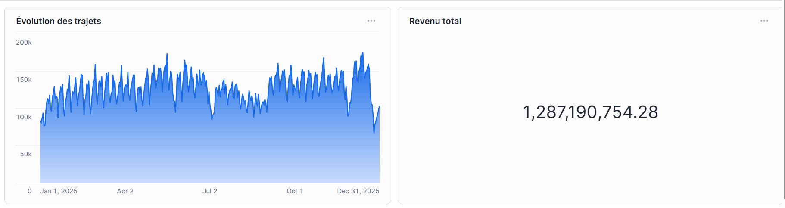
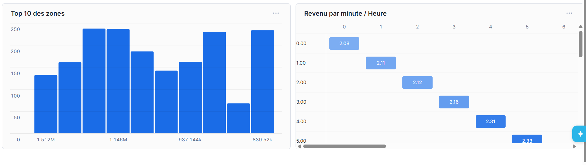

# 🚕 NYC Taxi Data Pipeline (dbt + Snowflake)

[](https://github.com/GautierGavat/nyc_taxi_pipeline/actions/workflows/dbt_run.yml)


Ce projet met en place un pipeline **ELT (Extract, Load, Transform)** moderne pour traiter et analyser les données massives des Taxis de New York (Yellow Taxi). L'objectif est de transformer environ **40 millions de lignes** de données brutes en indicateurs clés de performance (KPIs) exploitables.

---

## 📊 Aperçu du Dashboard (Snowflake)

### Analyse des Volumes et Revenus


### Analyse de la Rentabilité et des Zones


## 🏗️ Architecture du Projet 

Le projet suit une architecture en couches pour garantir la qualité, la modularité et la traçabilité des données :

### 1. Layer RAW (Bronze)
* **Source :** Fichiers Parquet mensuels de la NYC TLC (2024-2025).
* **Action :** Données brutes ingérées directement dans Snowflake.
* **Schéma :** `NYC_TAXI_DB.RAW`

### 2. Layer STAGING (Silver)
* **Nettoyage :** Suppression des trajets avec une distance nulle ou > 100 miles, et des montants négatifs (fare_amount, total_amount).
* **Filtres :** Validation de la cohérence temporelle (date de prise en charge < date de dépose).
* **Modèle dbt :** `stg_yellow_taxi_trips.sql`

### 3. Layer INTERMEDIATE (Silver+)
* **Calculs métiers :** Durée du trajet en minutes, vitesse moyenne, taux de pourboire.
* **Dimensions :** Catégorisation des distances (Court/Moyen/Long) et périodes de la journée (Rush Matinal, Soirée, Nuit, etc.).
* **Modèle dbt :** `int_trip_metrics.sql`

### 4. Layer MART (Gold)
* **Analyse :** Tables agrégées prêtes pour la consommation par des outils de BI (Tableau, PowerBI) ou SQL.
* **Tables finales :**
    * `mart_daily_summary` : Tendances quotidiennes (volume, revenus, distance moyenne).
    * `mart_hourly_patterns` : Analyse de la demande et de la fluidité du trafic par heure.
    * `mart_zone_analysis` : Identification des zones de départ les plus populaires et rentables.

---

## 🛠️ Stack Technique

* **Data Warehouse :** [Snowflake](https://www.snowflake.com/)
* **Transformation :** [dbt Core](https://www.getdbt.com/) (SQL modulaire, Jinja, tests intégrés)
* **Orchestration / CI/CD :** [GitHub Actions](https://github.com/features/actions)
* **Langage :** SQL & Python (pour l'ingestion initiale)

---

## 🤖 Automatisation et CI/CD

Le projet inclut un workflow **GitHub Actions** (`dbt_run.yml`) qui rend le pipeline autonome :

1. **Déclenchement :** Automatique à chaque `push` sur la branche `main` et planification mensuelle (`cron`).
2. **Sécurité :** Utilisation des **GitHub Actions Secrets** pour masquer les identifiants Snowflake (`SNOWFLAKE_USER`, `SNOWFLAKE_PW`, etc.).
3. **Workflow de déploiement :**
    * Installation de Python et des dépendances (`dbt-snowflake`).
    * Vérification de la connexion via `dbt debug`.
    * Exécution des transformations via `dbt run`.
    * Validation de la qualité via `dbt test`.

---

## 🚀 Installation et Utilisation Locale

### Préréquis
* Python 3.9+
* dbt-snowflake
* Accès à un entrepôt Snowflake

### Commandes rapides
```bash
# Installer dbt pour Snowflake
pip install dbt-snowflake

# Vérifier la configuration (nécessite profiles.yml)
dbt debug --profiles-dir .

# Lancer tout le pipeline
dbt run --profiles-dir .

# Lancer les tests de qualité
dbt test --profiles-dir .
```


## 🧪 Qualité et Tests
Nous appliquons des tests automatisés sur les colonnes critiques :
* **Unicité & Non-nullité :** IDs de trajets et timestamps.
* **Validation Métier :** Les montants doivent être positifs et les distances cohérentes.

---

## 📊 KPIs Implémentés
* **Volume de trajets** par type de jour (Semaine vs Weekend).
* **Vitesse moyenne** par période de la journée (identification des congestions).
* **Top 10 des zones** de départ les plus fréquentées.
* **Analyse de la rentabilité** (Revenu moyen par mile parcouru).

---
*Projet réalisé par **Gautier** - Expert Data Engineering Pipeline.*
